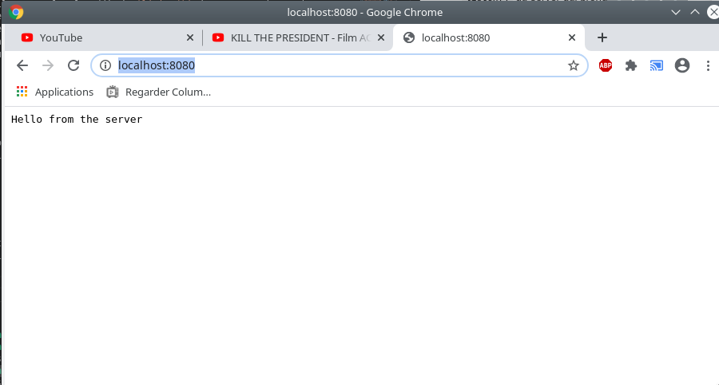
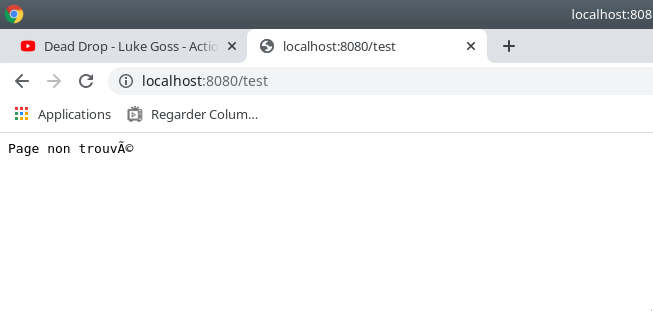

<!-- @import "[TOC]" {cmd="toc" depthFrom=1 depthTo=6 orderedList=false} -->

<!-- code_chunk_output -->

- [1. Installation et introduction  de nodejs](#1-installation-et-introduction-de-nodejs)
  - [1.1. Installation de nodejs](#11-installation-de-nodejs)
  - [1.2. Qu'est-ce que NoDEJs?](#12-quest-ce-que-nodejs)
  - [1.3. Resumé sur fonctionalités et cas d'utilisation de NodeJs](#13-resumé-sur-fonctionalités-et-cas-dutilisation-de-nodejs)
- [2. Apprentissage de NodeJS](#2-apprentissage-de-nodejs)
  - [2.1. Téléchargement des sources des projets](#21-téléchargement-des-sources-des-projets)
  - [2.2. Interaction avec la ligne de commande NodeJS](#22-interaction-avec-la-ligne-de-commande-nodejs)
  - [2.3. Premier programme en javascript sous vscode](#23-premier-programme-en-javascript-sous-vscode)
  - [2.4. Documentation de NodeJs](#24-documentation-de-nodejs)
  - [2.5. Lecture d'un fichier en Javascript](#25-lecture-dun-fichier-en-javascript)
  - [2.6. Ecriture/Creation d'un fichier en Javascript](#26-ecriturecreation-dun-fichier-en-javascript)
  - [2.7. Challenge et apprentissage:](#27-challenge-et-apprentissage)
  - [2.8. Code bloquant (synchrone) et non bloquant (asynchrone)](#28-code-bloquant-synchrone-et-non-bloquant-asynchrone)
    - [2.8.1. Qu'est-ce qu'un callback](#281-quest-ce-quun-callback)
    - [2.8.2. Exemple bloquant (synchrone)](#282-exemple-bloquant-synchrone)
    - [2.8.3. Exemple non bloquant (asynchrone)](#283-exemple-non-bloquant-asynchrone)
  - [2.9. Explication des callback dans les lectures asynchrones:](#29-explication-des-callback-dans-les-lectures-asynchrones)
  - [2.10. Pourquoi a-t-on besoin des appels non bloquant](#210-pourquoi-a-t-on-besoin-des-appels-non-bloquant)
          - [Voila comment Nodejs règle le problème:](#voila-comment-nodejs-règle-le-problème)
    - [Attention:](#attention)
  - [2.11. Lecture/Ecriture avec des callbacks chainés.](#211-lectureecriture-avec-des-callbacks-chainés)
- [3. Creation d'un serveur web simple avec nodejs](#3-creation-dun-serveur-web-simple-avec-nodejs)
- [4. Concept de routage](#4-concept-de-routage)

<!-- /code_chunk_output -->


# 1. Installation et introduction  de nodejs
## 1.1. Installation de nodejs
- desinstaller la version de NodeJs sur votre machine

```bash
patou@pc-pa:~$ aptitude search nodejs
  i   nodejs           - evented I/O for V8 javascript     
  v   nodejs-abi-46    -                               
  p   nodejs-dbg       - evented I/O for V8 javascript (debug)
  p   nodejs-dev       - evented I/O for V8 javascript (development files)
  p   nodejs-legacy    - evented I/O for V8 javascript (legacy symlink)    

```
(i) signifie que le package est installé. Donc il faut le desinstaller par:

```bash
patou@pc-pa:~$ sudo apt-get remove nodejs
```
- télécharger NodeJs sur le site officiel (https://nodejs.org), décompressez-le dans /opt et renommer le répertoire en nodejs.
Rajouter ensuite ce chemin dans .profile et .bashrc (nous utiliserons la version 12.x.x.x en date du 29/10/2019).
Ce qu'on rajoute dans .profile est le PATH vers nodejs/bin (il en est de même pour .bashrc).

**export PATH="$PATH:$JAVA_HOME/bin:/opt/jin-2.14.1-unix/jin-2.14.1:/opt/smartgit/bin:/opt/eclipse:/opt/firefox<span style="color:red">:/opt/nodejs/bin </span>"**

il faut ensuite tester nodejs si on l'a bien installé. Cela se fait par:

```bash
patou@pc-pa:~$ node -v
```
```bash
v12.13.0
```

## 1.2. Qu'est-ce que NoDEJs?
Nodejs est un environnement d'execution de Javascript muni des librairies de code Javascript.
Cela signifie qu'avec Node, on n'a plus besoin d'un navigateur pour executer Js mais on peut l'executer comme un programme en C++ ou en Python. Cela permet d'utiliser le js en tant que langage server-side (comme php ou python)


## 1.3. Resumé sur fonctionalités et cas d'utilisation de NodeJs

Presentation de NodeJs


# 2. Apprentissage de NodeJS
Pour commencer, nous allons apprendre NodeJS. Beaucoup de chose seront difficile au début (ou ne seront pas explicable) mais notre objectif est d'abord de coder en NodeJS. Plus tard, ces éléments seront clarifiés.

## 2.1. Téléchargement des sources des projets

Pour commencer, télécharger sur votre PC les codes sources de départ. Pour cela, forker le projet github suivant: (https://github.com/ajocelynpatrick/complete-node-bootcamp.git).

Ensuite choisissez un emplacement sur votre PC. Pour ma part, j'ai créé le répertoire  /home/patou/Documents/bizna/pasFini/ et je mettrai mon code source dedans (vous pouvez également le mettre sur le bureau). Pour cela, il faut :

```bash
patou@pc-pa:~$ cd /home/patou/Documents/bizna/pasFini/
patou@pc-pa:~/Documents/bizna/pasFini$ git clone https://github.com/ajocelynpatrick/complete-node-bootcamp.git
Cloning into 'complete-node-bootcamp'...
remote: Enumerating objects: 372, done.
Receiving objects:  93% (349/372), 41.04 MiB | 1.47 MiB/s
```
pour vérifier qu'on a bien descendu le dépôt git, il faut:

  ```zsh
    patou@pc-pa:~/Documents/bizna/pasFini$ ls
    backendNatours  complete-node-bootcamp  DjangoProj  OmniFood
  ```

on retrouve bien <span style="background-color:green">complete-node-bootcamp</span>


## 2.2. Interaction avec la ligne de commande NodeJS
Dans la suite, nous allons utiliser VSCode comme IDE.
Nous allons utiliser la ligne de commande fourni dans VSCode (mais on peut égalment utiliser la console linux car c'est la même ligne de commande).

- <u>Premier programme sous NodeJS</u>

  Pour écrire notre premier programme Node, nous allons utiliser la ligne de commande node en tapant ``"node"`` à la ligne de commande (utiliser soit la console soit le terminal sous vscode)

    ```bash
       patou@pc-pa:~$ node
       Welcome to Node.js v12.13.0.
       Type ".help" for more information.
       >
       > const name ='Patrick'
       undefined
       > 7+3
       10

       > .exit
    ```
Ce genre de ligne de commande s'appelle REPL (Read Eval Printing Loop)

**<u>Astuces</u>**
 - <u>Dans le code node suivant </u>:

```js
    > 24+2
    26
    > _+4  
    30

```

  '\_" signifie le résultat de l'opération précédent

 - <u>Tester la touche "tabulation"</u>
Afficher les méthodes d'une classe donnée (exemple de la classe String)

```js
> String.
String.__defineGetter__      String.__defineSetter__      String.__lookupGetter__      String.__lookupSetter__      String.__proto__
String.hasOwnProperty        String.isPrototypeOf         String.propertyIsEnumerable  String.toLocaleString        String.valueOf

String.apply                 String.arguments             String.bind                  String.call                  String.caller
String.constructor           String.toString              

String.fromCharCode          String.fromCodePoint         String.length                String.name                  String.prototype
String.raw

```

## 2.3. Premier programme en javascript sous vscode

Dans cette section nous allons créer un programme en js sous vscode. Importer le répertoire de notre projet sous vscode (comme on le ferait sous Atom ou Brackets <=> Open Folder).

Vous devriez avoir une interface comme dans la figure ci-dessous:


Ensuite créer un fichier index.js dans le projet (enregistrer dans le répertoire principal pour le moment)

Le contenu de notre fihier index.js sera comme suit:

```js
    const hello = "Hello";
    console.log(hello);
```
Sauvegarder le fichier. Normalement, nous devions executer ce code dans navigateur (en utilisant une page web pour le charger). Cependant, avec NodeJs, nous allons le lancer comme un executable ou un script.

Ouvrer un terminal, il est intéressant de savoir que vscode peut aussi ouvrir un terminal (pour moi Alt+T ouvre un terminal sur le projet)

``` bash
patou@pc-pa:~/Documents/bizna/pasFini/backendNatours$ node index.js
Hello
```

## 2.4. Documentation de NodeJs

Afin de pouvoir mieux se former sur NodeJs, voici la documentation officielle (https://nodejs.org/dist/latest-v12.x/docs/api/synopsis.html)

Par exemple, on retrouve dans la section REPL (chercher plus bas dans le menu de gauche), la documentation sur le REPL
(https://nodejs.org/dist/latest-v12.x/docs/api/repl.html). Les sections qu'on voit dans le menu de gauche sont appelé des modules. Pour utiliser un module, il faut l'importer.

Exemple d'import du module fs (https://nodejs.org/dist/latest-v12.x/docs/api/fs.html)

```js
const fs = require('fs');
```

## 2.5. Lecture d'un fichier en Javascript
Nous allons utiliser le module FS (File System) avec sa fonction `readFileSync()`. Cette fonction permet de lire un fichier de manière synchrone (c'est à dire que le code ne continue pas tant que la lecture n'est pas fini).


Nous allons d'abord copier le répertoire Node-Farm des exemples dans notre répertoire des projets et surtout supprimer le répertoire final et ne garder que starter.

Vous devriez avoir le projet ci-dessous


Ensuite nous allons modifier notre fichier index.js. Nous allons:

- effacer le contenu complet du fichier
- importer le module file system
  ```js
  const fs = require('fs')
  ```
- lire le texte input.txt qui est dans le répertoire txt de node-farm. Pour cela, nous allons utiliser la fonction `readFileSync()` et récupérer son retour dans une variable appelé `textIn`.

Notre code devrait ressembler à ceci:

```js
 // importer le module file system
const fs = require('fs');
// lire un fichier et mettre son résultat dans une var textIn
const textIn = fs.readFileSync('./1-node-farm/starter/txt/input.txt', 'utf-8');
// afficher le contenu de la variable
console.log(textIn);
```

L'execution du code nous donne:

```bash
patou@pc-pa:~/Documents/bizna/pasFini/backendNatours$ node index.js
The avocado 🥑 is popular in vegetarian cuisine as a substitute for meats in sandwiches and salads because of its high fat content 😄
```

## 2.6. Ecriture/Creation d'un fichier en Javascript

Nous allons maintenant modifier le même programme dans `index.js` et créer un texte que nous allons écrire dans un nouveau fichier texte.

```js
// texte à ecrire dans un fichier 
// les guillements sont des backticks (AltGr+7 et espace).
// c'est une manière de concatener un string sous ES6 (une version meilleur de js)
const textOut = `This is what we know about the avocado: \n${textIn}. \nThis text was created on ${Date.now().toString()}`
// ecrire dans un fichier ecriture.txt dont on donne le chemin relatif (ou complet)
fs.writeFileSync('1-node-farm/starter/txt/ecriture.txt',textOut,'utf-8')
console.log(textOut)
```
## 2.7. Challenge et apprentissage:

Pour se familiariser aux variables en js, lire la doc et faire le challenge Day 1 de javascript sur hackerrank.
https://www.hackerrank.com/challenges/js10-let-and-const/


## 2.8. Code bloquant (synchrone) et non bloquant (asynchrone)

### 2.8.1. Qu'est-ce qu'un callback
Un callback est une fonction qui est appelé à la fin de l'execution d'une tâche/action. Tous les API de NodeJs sont ecrits de manière à supporter des callbacks.

### 2.8.2. Exemple bloquant (synchrone)
```js
    const fs = require("fs");
    const data = fs.readFileSync('input.txt');

    console.log(data.toString());
    console.log("Program Ended");
```
Le code est executé ligne par ligne et même si la lecture du fichier dure plusieurs heures, le code est bloqué et ne continue que si la ligne d'avant est finie.


### 2.8.3. Exemple non bloquant (asynchrone)
Nous allons créer un nouveau fichier `readfile_asynchrone.js`, dans lequel, nous allons mettre le code suivant :

D'après la doc (https://nodejs.org/dist/latest-v12.x/docs/api/fs.html), nous avons le prototype suivant :
```js
 1	const fs=require('fs')
 2	
 3	fs.readFile ('./1-node-farm/starter/txt/input.txt', 'utf-8', (err, data) => {
 4	    if (err)
 5	    { 
 6	        throw err;
 7	    } 
 8	    console.log(data);
 9	  });
10	
11	  console.log('debut de lecture de fichier ....');
12
```
Le code précédent s'écrit avec une lambda -fonction (on peut trouver la documentation simple [ici](https://www.tutorialspoint.com/es6/es6_functions.htm) (https://www.tutorialspoint.com/es6/es6_functions.htm)

Ce code peut s'écrire avec une fonction en notation js aussi 

```js
 1   const fs=require('fs')
 2   
 3   fs.readFile ('./1-node-farm/starter/txt/input.txt', 'utf-8', function (err, data) {
 4       if (err)
 5       { 
 6           throw err;
 7       }
 8       console.log(data);
 9   });
10  
11  console.log('debut de lecture de fichier ....');
```

## 2.9. Explication des callback dans les lectures asynchrones:
   
   En general dans un callback, le premier argument sera l'erreur `err`. Et `data` contiendra la donnée qui sera retourné.

   L'execution de notre code nous donne 
   
```sh
   patou@pc-pa:~/Documents/bizna/pasFini/backendNatours$ node readfile_async.js 
   debut de lecture de fichier ....
   The avocado 🥑 is popular in vegetarian cuisine as a substitute for meats in sandwiches and salads because of its high fat content 😄
```
   Que s'est-il passé? 
   Le message affiché par la ligne 11 est affiché avant la lecture du fichier. Pourquoi? parce que notre code est asynchrone et non bloquant. Le programme commence par lire le fichier (mais il ne finit pas tout de suite sa lecture) et donc le programme ne se bloque pas en attente de la finition de la lecture (Le code est donc non bloquant). Le résultat de la lecture est retourné par le callback (la function) qui sera appelé lorsque la lecture sera finie.
   
   Le programme continue son execution et on obtient un programme qui ne s'execute pas forcément dans l'ordre d'écriture. (Le code est asynchrone). 


## 2.10. Pourquoi a-t-on besoin des appels non bloquant
 Parce que Node est monoThread (une seule thread pour tous les instructions), ce qui signifie qu'on ne peut pas faire des executions en parallèle.
 
  =>   <p></p>  => 
 
 Que se passera-t-il quand chaque personne demandera une action ou une ressource? On obtiendra ceci:
 
   => 
 
 Si les programmes sont synchrones alors il faut attendre que le premier se termine avant de pouvoir continuer le deuxième, etc. etc.
 
 PS: C'est le role du developper de résoudre le problème en faisant du code asynchrone 
 
 
###### Voila comment Nodejs règle le problème:
 Un programmeur code en asynchrone et passe la main pour que les autres continue. Les tâches lourdes sont executés en tâche de fond (background).
     =>

### Attention: 
Le fait d'utiliser une callback ne fait pas que le code entier devient asynchrone.

 ###### Callback hell
 un callback hell sont des callbacks qui sont imbriqués avec des interdépances difficiles à lire et à comprendre.
 
 
 
 Le triangle qu'on voit en rouge, est un signe que le code est un callback hell. Pour éviter/résoudre les callback hell, il faut utiliser des concepts nouveaux comme les promises, Async/await. 
 
## 2.11. Lecture/Ecriture avec des callbacks chainés.
<u>Exercice 1:</u>
- Dans le répertoire txt, nous avons un fichier qui s'appelle `start.txt`. Dans ce fichier nous avons le contenu suivant : `read-this`.
- créer un programme en `read_write.js` qui lit le contenu du fichier `start.txt` en mode asynchrone (aide: le code qu'on vient de faire plus haut dans le document fait exactement cela - lire un fichier et afficher sont contenu)

La correction est la suivante : 

  ```js
     1  const fs=require('fs');
     2
     3  fs.readFile('./1-node-farm/starter/txt/start.txt','utf-8', (err,data)=>{
     4      if (err){
     5          throw err;
     6      }
     7      else 
     8      {
     9          console.log(data);
    10      }
    11  });

   ```
L'execution nous affiche la sortie suivante:
 
 ```bash
    patou@pc-pa:~/Documents/bizna/pasFini/backendNatours$ node read_write.js 
    read-this
  ```

<u>Exercice 2:</u>
La sortie contient une chaine de caractère (ici: `read-this`). Nous allons alors utiliser ce résultat pour lire le fichier 
`read-this.txt` qui est dans le même répertoire.

<u>Remarque:</u> Ne pas lire le nom du fichier en dur car nous allons vouloir le changer plus tard
(Aide: pour lire le contenu d'une variable x par exemple en js on utilisera \`${x} \` 
comme dans angularjs ou Jquery)

<u>*Réponse:*</u>

On souhaite lire le fichier dont le nom est `data`. Or `data` tel qu'il est retourné contient le text `read-this` et on se rend compte que dans le répertoire on a un fichier qui s'appelle `read-this.txt`.

On reprend le code de l'exercice d'avant. Au lieu d'afficher le texte (ligne 9), on va utiliser la donnée `data` (ou plutôt le contenu de la donnée `data`). Le résultat est mis dans `data2`

 ```js
     1  const fs=require('fs');
     2
     3  fs.readFile('./1-node-farm/starter/txt/start.txt','utf-8', (err,data)=>{
     4      if (err){
     5          throw err;
     6      }
     7      else 
     8      {
     9          console.log('Lecture de start.txt est fait. Les données lues sont : ', data);
    10          console.log ('on va lire le fichier ' , `${data}`+'.txt');
    11          fs.readFile('./1-node-farm/starter/txt/'+`${data}`+'.txt','utf-8', (err,data2)=>{
    12              if (err){
    13                  throw err;
    14              }
    15              else 
    16              {
    17                  console.log(data2);
    18              }
    19          });
    20          console.log('Le contenu du fichier ', `${data}`+'.txt est :')
    21      }
    22  });
   ```

<u>Exercice 3:</u>
Rajouter après la lecture du fichier `read-this.txt`, une autre callback qui lit le fichier `append.txt` et qui met sa réponse dans `data3`

<u>*Réponse à voir dans le fichier `read_write.js` dans le commit suivant*</u>

<u>Exercice 4:</u>
Ecrire la donnée `data2`et `data3` dans un fichier appelé `output.txt`

Pour aller un peu plus loin avec les fichier, je vous recommande de jouer avec les exemples sur -  
 - https://www.w3schools.com/nodejs/nodejs_filesystem.asp
 - https://www.tutorialspoint.com/nodejs/nodejs_file_system.htm


# 3. Creation d'un serveur web simple avec nodejs

- Commencer par créer un fichier `web_server.js` sous vscode.
- La première étape est d'importer le package `http` afin d'avoir accès à toutes les librairies de réseau.
    ```js
        const http = require('http');
    ```
- le seconde étape est de créer le server avec la méthode `createServer()` du module http. Cette méthode prend en entrée une callback et cette callback prend 2 variables: `request` et `response` (on peut utiliser d'autres noms). Nous allons donc créer le serveur avec une callback qui nous enverra la réponse textuelle suivante :'`Hello from the server`. Pour renvoyer cette réponse, on utilisera la methode `end()` de la variable `response`
    
    ```js
        const webserver=http.createServer( (request, response) => {
            //affichons la réponse du server 
            response.end('Hello from the server');
        });
    
    ```
<u>Remarque:</u> La callback de la méthode `createServer()` est appelé à chaque fois que le serveur reçoit une requete de la part du client.
    
- Il faut se mettre à l'écoute des requetes et pour cela, nous allons appeler la méthode `listen()` du server qui prend
deux paramètres: le numero de port d'écoute et l'adresse du server (dans notre cas, on utilisera `localhost`). 
La méthode `listen()` prend également en argument un callback qui est appelé lorsque le serveur commence à écouter.
   ```js
        webserver.listen(8080,'127.0.0.1', ()=>{
            console.log('Ecoute sur le port 8080 de localhost');
        });
   ```

Pour tester, nous allons lancer le programme `web_server.js` en ligne de commande:

```js
  patou@pa-linux:~/Documents/bizna/pasFini/backendNatours/fichier_projets/examples$ node web_server.js 
```

et allons ouvrir une page internet dans un navigateur et le lien qu'on mettra sera `http://ocalhost:8080`:




# 4. Concept de routage

- Qu'est-ce que le routage?
  Un système de routage permet de faire correspondre une URL donnée à une page précise. On définit donc que l'URL est la route vers la page.

- Implementation d'un routage simple dans Node( from scratch <=> partant de zero)

- Dans les applications réelles, le routage peut devenir très compliqué donc on utilise Express.js (un framework en js ) pour le gérer.

Commençons par regarder notre serveur web simple de la section précédente. On se rend compte que l'application ne réagit par du tout au changement d'url. Testons:
- si on utilise l'url suivant : 
`http://localhost:8080/product`, la page contient toujours le même texte. Donc la réponse est toujours la même.

Le routage en developpement web consiste à implémenter des actions (ou des pages) différentes pour différents urls.

Dans les projets plus que nous allons implémenter plus loin, nous utiliserons `Express.js` mais pour ce cas simple, nous allons le faire en nodejs.

Nous allons continuer avec notre programme `web_server.js` (que nous allons réenregistrer dans un nouveau fichier `routage.js`)
- la pemière  étape consiste à fournir un moyen au programme d'analyser l'url de la page. Pour cela, nous allons utiliser un module nodejs qui s'appelle `url`.
    ```js
        const url = require('url');
    ```
- La deuxième étape consiste à afficher (seulement l'url à partir de la requête dans la fonction `createServer`). Dans cette fonction, nous allons ajouter une instruction qui affiche l'url à partir de la requête.

    ```js
        console.log(request.url);
    ```
Maintenant, si on ouvre l'url `http://localhost:8080` dans un navigateur, il nous affiche les sorties suivantes :
```sh
patou@pa-linux:~/Documents/bizna/pasFini/backendNatours/fichier_projets/examples$ node routage.js 
Ecoute sur le port 8080 de localhost
/
/favicon.ico
```
Et si on ouvre l'url `http://localhost:8080/index`, on obtient l'affichage ci-dessous:
```sh
patou@pa-linux:~/Documents/bizna/pasFini/backendNatours/fichier_projets/examples$ node routage.js 
Ecoute sur le port 8080 de localhost
/index
/favicon.ico
```

De ce qu'on comprend, on a dit qu'à chaque requête, on appelle la fonction `createServer`. Là nous avons fait une requête mais on a deux affichage d'url. 
- le `/` 
- le `/favicon.ico`

En effet, pour chaque requête qu'on fait, le navigateur fait  toujours automatiquement une autre requête pour avoir le favicon.
C'est ce qui explique qu'on affiche à chaque fois deux urls.

Cependant, ce qui nous interesse vraiment est le premier url qui n'est pas le favicon.

Essayons un url un peu plus complique avec des query strings pour faire une requete de type `GET`. 
Pour un petit aide mémoire sur les requete `GET`, aller ici (https://www.w3schools.com/tags/ref_httpmethods.asp)

Allez dans votre navigateur et tapez l'url suivant:
`http://localhost:8080/overview?identifiant=toto?nom=titi`

Nous obtenons comme url de la requete:
`/overview?identifiant=toto?nom=titi`

C'est pour parser ces variables passé en query string par exemple que le module `url` de nodejs nous sera utile.

Maintenant qu'on comprend mieux les url, nous allons implémenter le routage. Nous allons faire en sorte que si on tape l'url:
`http://localhost:8080/overview`, on ait un message et si on tape l'url `http://localhost:8080/product`, on ait un autre message.


Dans la fonction `createServer`, 
- sauvegarder l'url de la requete dans une variable nommé `pathName`;

- Pour créer un routeur simple, nous allons tester si la valeur de cette variable `pathName` est égale à un texte ou à un autre et afficher la réponse correspondante. Nous allons créer une route vers `/overview`, `/product`. Pour cela, il faut juste tester si la variable `pathName` (qui contient l'url) est égale à l'un ou l'autre de ces deux valeurs.
Si l'url est égale à `/` ou à `/overview` alors on va afficher `This is the OVERVIEW` et si l'url est `/product` alors on va afficher `This is the PRODUCT`.

Proposez votre solution et comparez avec la réponse.

La réponse est dans le répo git dans le fichier `routage.js`. Lancer le fichier en ligne de commande par `node routage.js` et tester les url dans le navigateur.


Si maintenant on entre un url qui n'est pas géré par notre algorithme de roytage, la page web n'arrête pas de mouliner car le serveur essaye de trouver une récponse adéquate mais n'y arrive pas. (ex: essayez `http://localhost:8080/test`). Il nous faudra alors rajouter un else dans notre algorithme afin que toute route qui n'est pas trouvée soit géré par notre algorithme de routage simple.

initialiement nous avions:
```js
if (... || ... )
{

}
else if (....)
{

}
```
Nous allons alors rajouter une clause `else` à la fin pour dire à notre serveur que la page n'a pas été trouvée.

```js
if (... || ... )
{

}
else if (....)
{

}
else 
{
  res.end('Page non trouvé');
}
```
Proposez une solution et testez.

Voici la solution complète :

```js
const http = require('http');
const url = require('url');


const webserver=http.createServer( (request, response) => {
    // pour pouvoir analyser l'url, nous allons d'abord l'afficher.
    console.log(request.url);
    const pathName = request.url;
    //  || est l'opérateur OU en javascript
    // === est l'operateur de comparaison de chaine de caractère en js
    // doc officiel https://developer.mozilla.org/fr/docs/Web/JavaScript/Reference/Op%C3%A9rateurs/Op%C3%A9rateurs_de_comparaison
    
    if (pathName === '/' || pathName === '/overview')
    {
        //affichons la réponse du server 
        response.end('Ceci est l\'OVERVIEW');
    }
    else if (pathName==='/product')
    {
        //affichons la réponse du server 
        response.end('Ceci est le PRODUCT');
    }
    else 
    {
        response.end('Page non trouvé');
    }

});

webserver.listen(8080,'127.0.0.1', ()=>{
    console.log('Ecoute sur le port 8080 de localhost');
});
```

Cependant, on se rend compte que l'affichage dans la page web est incorrecte car le caractère accentué n'est pas géré pour le mot `trouvé`.



Ce problème est causé par le fait que le navigateur n'utilise pas un encodage des caractères qui supporte les accents. Il faut alors qu'on modifie le header http de la page dans le code. Pour cela, il faut rajouter le code suivant à la ligne 13 avant qu'on envoie les réponses au navigateur :

```js
response.setHeader("Content-Type", "application/json; charset=utf-8");
```
Testez. Le problème devrait être résolu.


